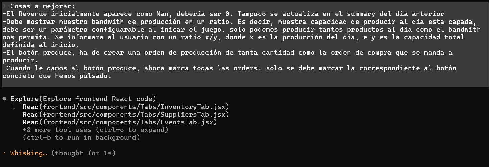
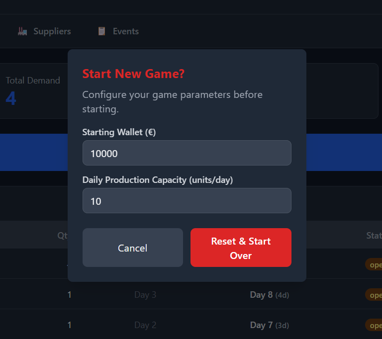
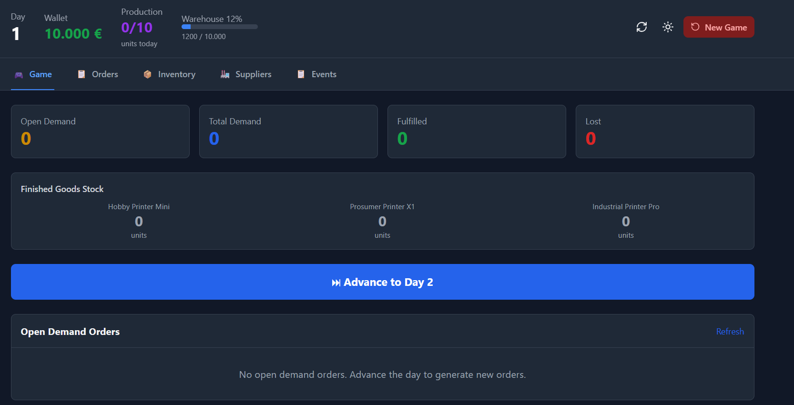
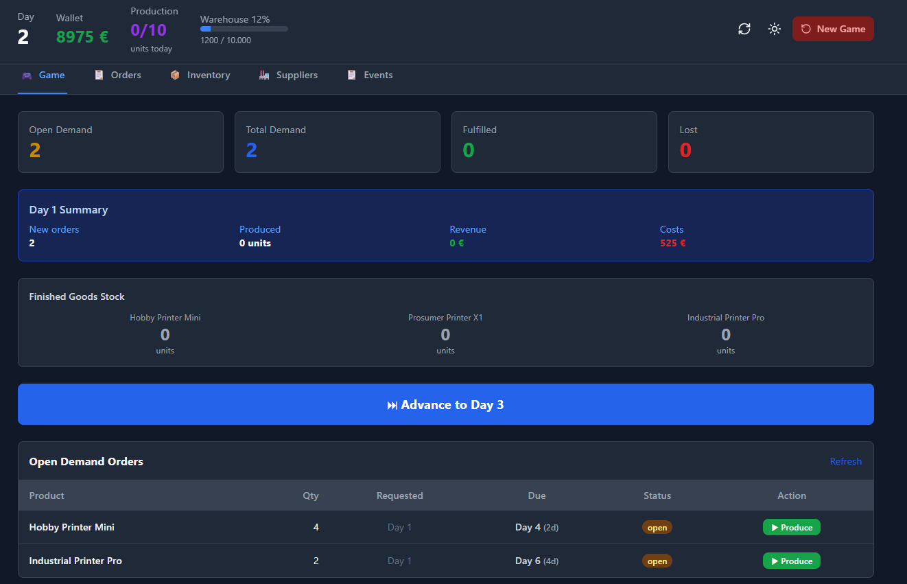
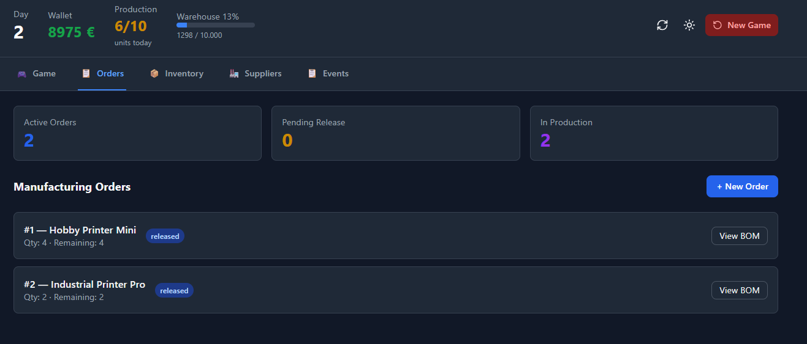
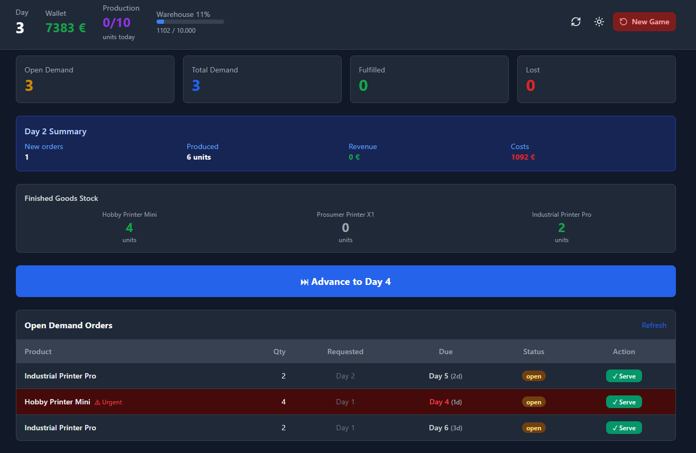
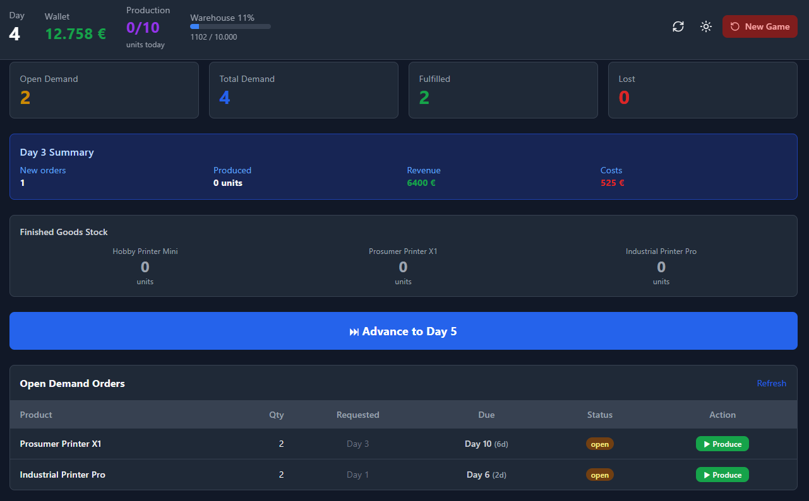
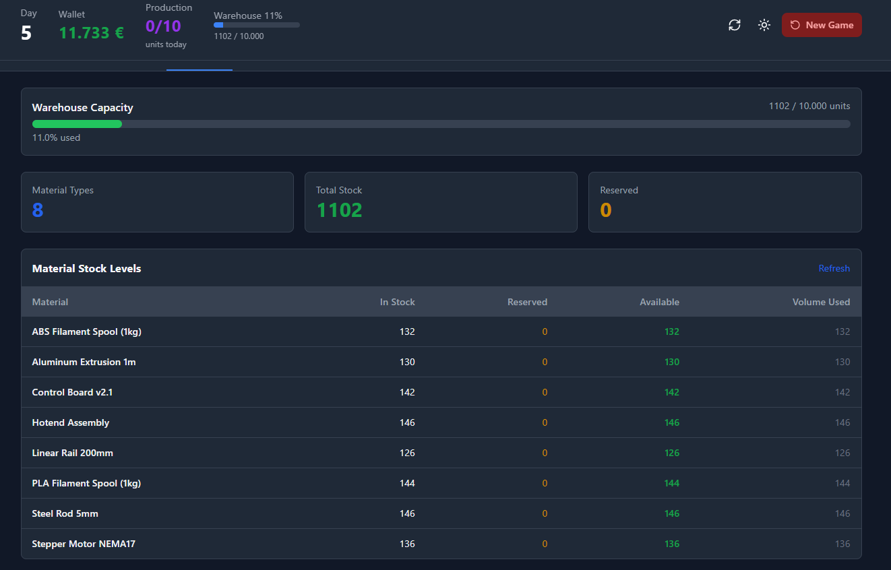
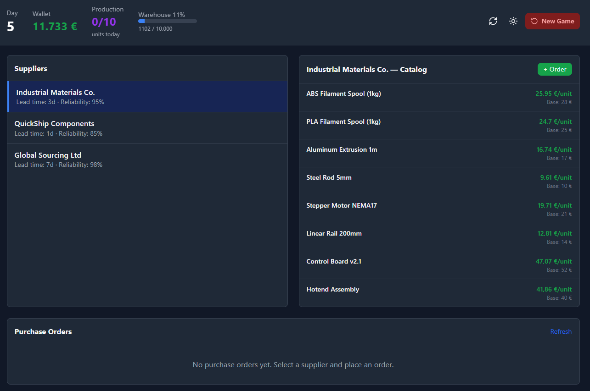

# Laboratori 5

**Autors:**
Marc Expósito  

Àngela Giribet  

Joan Teruel  

---

## 1. Decisions de disseny

### 1.1. Model de dades

El model de dades adoptat pel projecte parteix de l'especificació inicial, però incorpora diverses decisions pròpies del nostre equip orientades a garantir coherència funcional, simplicitat operativa i facilitat de simulació. L'objectiu principal era obtenir un model que permetés representar fidelment el cicle productiu d'una fàbrica de 3D printers, mantenint alhora una estructura clara i fàcilment consultable des de SQLite.

#### Separació explícita entre productes "raw" i "finished"

Tot i que l'enunciat ja suggeria aquesta distinció, el nostre equip va decidir formalitzar-la com un camp obligatori dins la taula Product. Aquesta decisió respon a tres motius:

- evitar inconsistències en la definició de BOMs,
- simplificar la validació de disponibilitat de materials,
- facilitar consultes SQL i càlculs de consum.

#### BOM com a taula relacional independent

La taula `BOM(finished_product_id, material_id, qty)` es va mantenir, però vam reforçar-ne l'ús com a font única de veritat per al càlcul de consum. Aquesta decisió va facilitar la implementació posterior del càlcul automàtic de disponibilitat.

#### Integració del wallet i costos diaris

L'enunciat només mencionava la necessitat de mantenir un balanç positiu, així que el nostre equip va ampliar aquesta idea incorporant:

- Costos diaris de manteniment parametritzables
- Bloqueig automàtic de compres que portarien el balanç a negatiu
- Avisos quan el wallet s'apropa a zero
- Variació diària dels preus dels proveïdors

---

### 1.2. Decisions d'Arquitectura

#### Rebuig de SimPy

Tot i que l'enunciat recomanava SimPy, el nostre equip va decidir no utilitzar-lo. Els motius principals van ser:

1. El simulador és discret i seqüencial, no basat en processos paral·lels.
2. La integració amb FastAPI i SQLite és més directa amb un bucle diari.
3. La traçabilitat i el debugging són molt més clars amb una funció `advance_day()`.

#### Arquitectura FastAPI + UI separada

L'agent inicialment suggeria Streamlit com a UI principal integrada amb el backend. El nostre equip va decidir:

- **Backend** completament desacoblat amb FastAPI, responsable de:
  - lògica de negoci,
  - simulació,
  - persistència,
  - exposició REST.
- **Frontend** lleuger amb Streamlit, que només:
  - consulta l'API,
  - mostra dades,
  - envia accions de l'usuari.

Aquesta separació és una aportació pròpia i respon a:

- la necessitat de complir R8 (tota funcionalitat via REST),
- la voluntat de mantenir modularitat i testabilitat,
- la possibilitat futura de substituir Streamlit sense tocar el backend.

#### SQLite com a base de dades primària

Tot i que l'enunciat permetia JSON com a alternativa, nosaltres vam decidir:

- SQLite com a font primària de persistència,
- JSON només per a import/export.

Aquesta decisió va ser nostra i respon a:

- integritat relacional,
- consultes eficients,
- facilitat de testing,
- simplicitat de desplegament.

---

### 1.3. Trade-offs discutits com a equip

#### SimPy vs bucle diari

- **SimPy:** potent però complex i difícil d'integrar.
- **Bucle diari:** simple, transparent, fàcil de testejar.

Finalment vam decidir **bucle diari**.

#### Streamlit vs HTML/JS personalitzat

- **Streamlit:** ràpid i suficient.
- **HTML/JS:** més flexible però més lent de desenvolupar.

Finalment vam decidir **Streamlit** per velocitat i simplicitat.

#### Distribució de demanda global vs per model

Claude proposava paràmetres per model, però nosaltres vam decidir una distribució global, més fidel a l'enunciat i més simple de configurar.

#### Gestió econòmica mínima vs ampliada

L'enunciat només exigia evitar balanç negatiu. Nosaltres vam ampliar-ho amb:

- costos diaris,
- variació de preus,
- bloqueig de compres,
- avisos de risc.

---

## 2. El procés de construcció del PRD

### 2.1. Metodologia de treball amb Claude Code

El PRD es va desenvolupar mitjançant un procés iteratiu basat en:

1. Proporcionar l'enunciat complet a l'agent
2. Respondre les preguntes de disseny que generava
3. Revisar críticament les seves propostes
4. Corregir i reorientar quan calia
5. Consolidar les decisions en un document coherent

---

### 2.2. Aportacions pròpies respecte les propostes inicials de l'agent

Les diferències més rellevants entre el que proposava Claude Code i el que finalment vam adoptar són:

1. **Rebuig de SimPy** — L'agent insistia en SimPy; nosaltres vam argumentar i justificar un model seqüencial.
2. **Arquitectura desacoblada** — Claude suggeria Streamlit com a capa principal. Nosaltres vam imposar una separació estricta Streamlit ↔ FastAPI.
3. **Model econòmic ampliat** — L'agent no contemplava costos diaris ni variació de preus. Nosaltres vam incorporar:
   - costos fixos,
   - bloqueig de compres,
   - avisos de risc,
   - volatilitat de preus.
4. **Simplificació d'estats** — Claude proposava estats més complexos. Nosaltres vam prioritzar la simplicitat operativa.
5. **Distribució de demanda** — L'agent proposava paràmetres per model. Nosaltres vam optar per una distribució global.

---

### 2.3. Prompts que van funcionar

Per acabar de refinar els últims detalls, hem anat comentant-li al Claude quines funcionalitats i processos havia d'acabar de pulir perquè la fàbrica funcionés eficientment i tal i com volíem nosaltres.

Aquí deixem alguns exemples de matisos que no havia tingut en compte. La majoria d'ells eren encarats a la usabilitat de l'usuari en la pantalla d'inici, però n'hi havia d'algun tecnicisme sobre com volem que funcioni la nostra fàbrica:

- Afegeix un botó des de la pantalla d'inici per enviar a producció les màquines que tenim a l'apartat de comandes, perquè de moment ho he de fer manualment jo des de la pestanya de comandes.
- El Revenue inicialment apareix com a NaN, en lloc de 0. A més no es va actualitzant a mesura que avancen els dies.
- Ha de mostrar la nostra capacitat de producció en un rati i que aquest pugui ser configurable

---

## 3&4. Screenshots of the working application i Analysis of a test scenario

En el present apartat fusionem tant les captures del Dashboard d'un complete day cycle, com també la demostració de la simulació de 5 dies dins de la fàbrica. En aquest apartat detallem tant la progressió d'un mateix dia a través de les diferents decisions que anem prenent durant els diferents dies, com també l'evolució que experimenta la fàbrica al llarg dels 5 dies.

---

### Inici de la partida

En cada inici nou d'una partida, ens permet decidir quina quantitat de diners tindrem al Wallet i quina capacitat màxima podrem produir cada dia.

---

### Dia 1

La captura mostra una captura de la nostra pantalla inicial (dashboard) de la fàbrica. Així doncs, el nostre inventari (warehouse) inicial de peces no és zero, ja que comencem amb un percentatge ja emplenat. Per altra banda, també veiem que la quantitat de productes acabats de tots els tipus com també totes les estadístiques estan a zero, ja que encara no hem començat a operar. Així que avancem cap al dia 2 per començar a experimentar.

---

### Dia 2

En el nostre segon dia operatiu de la nostra fàbrica, veiem que els valors de la pantalla inicial han variat una mica. Primerament, el valor del Wallet ha baixat, ja que ens costa diners mantenir la Warehouse. Aquesta va ser una de les nostre decisions de disseny, ja que sinó la decisió més òptima seria no completar cap ordre per tal de no haver de sufragar despeses en comprar més inventari per poder completar les diferents comandes.

Per altra banda, veiem que ja ens han aparegut diverses comandes pendents per completar dels nostres fidels clients. Cada una demana un producte determinat, com també una quantitat d'aquell producte i la data de venciment d'aquesta comanda. Aquest últim atribut és important perquè la dashboard ens avisarà d'aquelles comandes que són urgents, com també s'ordenen totes les comandes segons aquesta data.

Des de la llista de "Open Demand Orders" ja es poden enviar directament a producció. Així que, en aquest cas, les hem enviat totes. I ho comprovem a la pestanya "Orders" com veiem a la captura següent.

---

### Dia 3

En el nostre cas, les impressores triguen 1 dia a completar-se perquè tenim una fàbrica molt eficient. Així que, en el nostre tercer dia, les impressores que havíem enviat a producció en el dia 2 ja estan completades i preparades per servir als clients en l'apartat "Open Demand Orders".

Aquesta captura també ens permet veure la importància de la data de caducitat, ja que com que tenim una comanda que hem d'entregar l'endemà ens avisa que és urgent.

---

### Dia 4

Com que vam entregar algunes impressores ja als clients, significa que vam cobrar la part corresponent. Així que, a la pantalla d'inici tenim un apartat de Resum del dia anterior, on hi apareix un increment del Revenue, fent referència als diners que hem aconseguit amb les comandes, com també augmenta corresponentment el Wallet.

---

### Dia 5

En l'últim dia de la nostra demostració, com que les funcionalitats principals de la nostra pàgina d'inici ja han estat aprofundides, aquí ens centrarem en la pestanya d'Inventory i de Suppliers.

Per tant, a continuació veiem primerament una captura de la pestanya d'Inventory, on es visualitza detalladament què hi trobem aquí. Com per exemple el percentatge de capacitat que tenim a la Warehouse.

Per altra banda, la pestanya de Suppliers que aprofundirem més en la següent entrega.

---

## 5. Vibe coding reflection

### 5.1. How did you divide work in the team?

Inicialment vam fer el PRD discutint tots junts per definir correctament els requeriments que la nostra fàbrica volíem que satisfés. A continuació, li vam llançar al nostre agent (el quart membre del nostre equip) perquè comencés a treballar, juntament amb el prompt que acabés de preguntar-nos totes aquelles inquietuds que no li quedaven clares. Així doncs, entre tots vam acabar de confirmar com volíem que encarés el projecte.

Un cop vam acabar la definició, teníem un membre de l'equip iterant amb l'agent, mentre la resta documentava el procés per evitar conflictes entre els projectes si hi involucràvem més d'un agent diferent.

---

### 5.2. What did Claude Code do well? Where did it struggle?

Claude va preguntar-nos inicialment algunes qüestions abans de començar a treballar per poder encarrilar-se bé i va preguntar-nos algunes característiques no havíem acabat de definir bé. Tot i això, en algun moment va petar el frontend i ens donava error, i el vibe coding no ens permetia fer un debugging ràpid, així que ens costava identificar on fallava exactament.

Primerament pensàvem que simplement era que no ens havíem connectat correctament a l'IP del multipass, ja que és des d'on l'estàvem utilitzant i al nostre navegador l'URL hi teníem localhost. Però també ens donava Connection Error.

---

### 5.3. What would you do differently next time?

Ho hem fet el millor que hem sabut i pogut en aquest moment, una altra vegada també seguiríem esforçant-nos per tirar endavant un projecte fet amb vibe-coding, tot i que insistir a una màquina que arregli quelcom que ella ha tirat endavant és complicat i bastant frustrant.

---

### 5.4. Did the PRD-first approach help? How?

Creiem que sí, doncs t'ajuda a definir unes guidelines per poder encarrilar bé el projecte i realitzar les decisions de disseny que igualment es faria encara que no féssim vibe-coding. Tot i això, el fet de muntar el projecte externament complica el seguiment i, conseqüentment, el testeig d'errors seqüencial.
